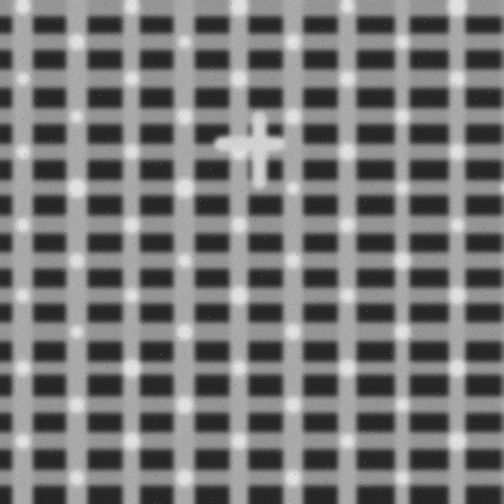
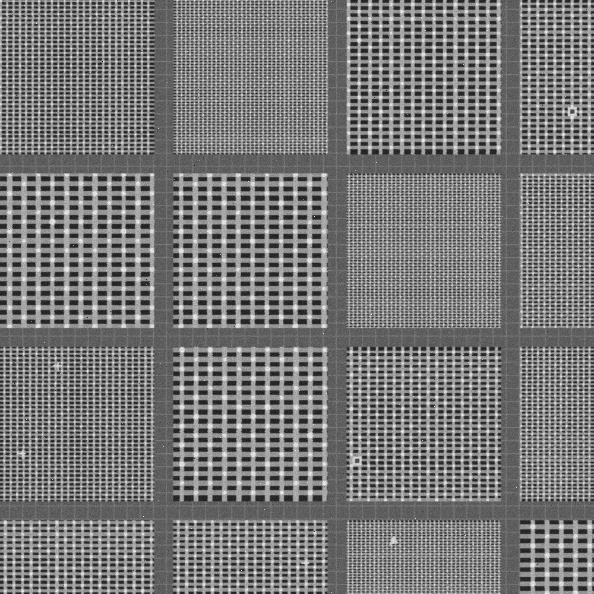
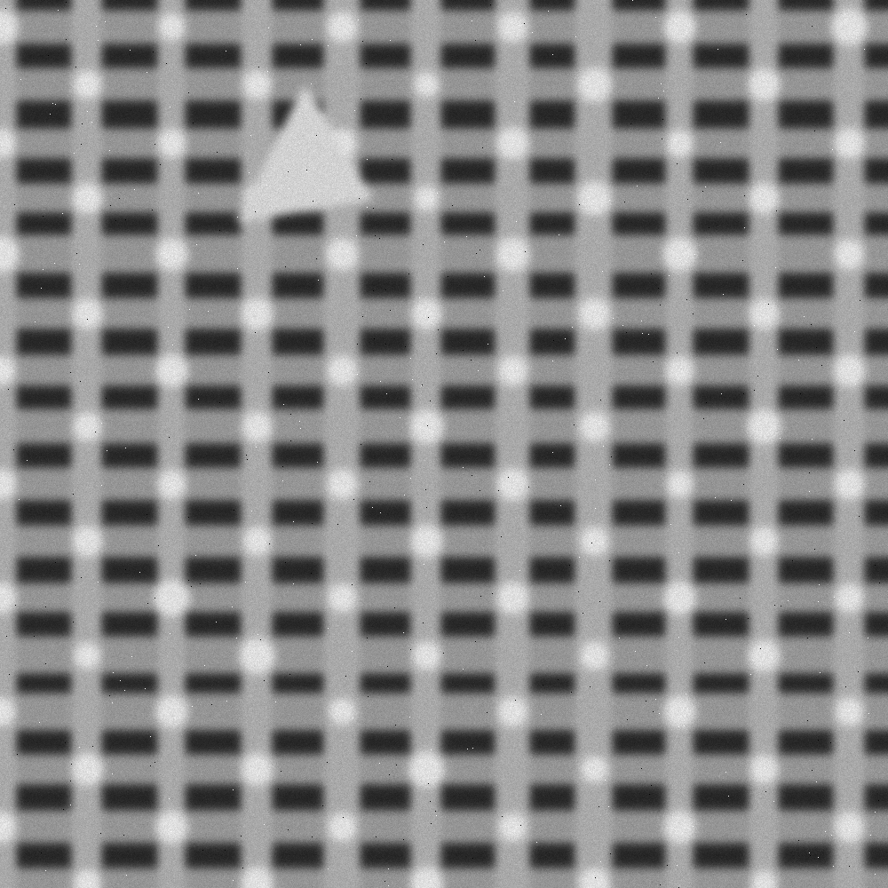
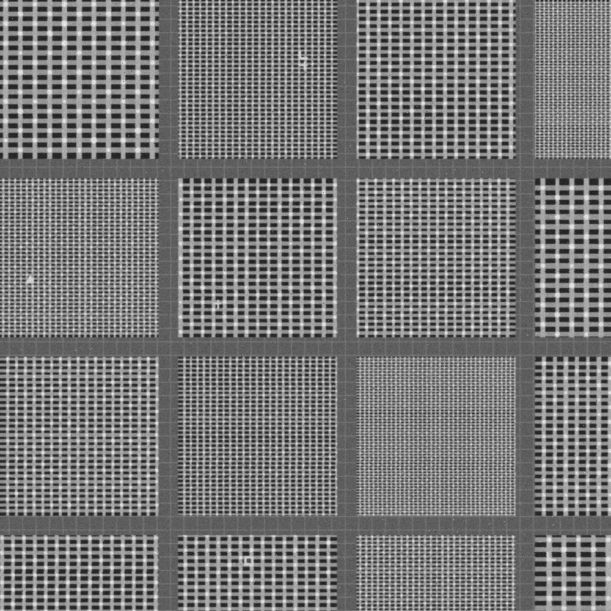
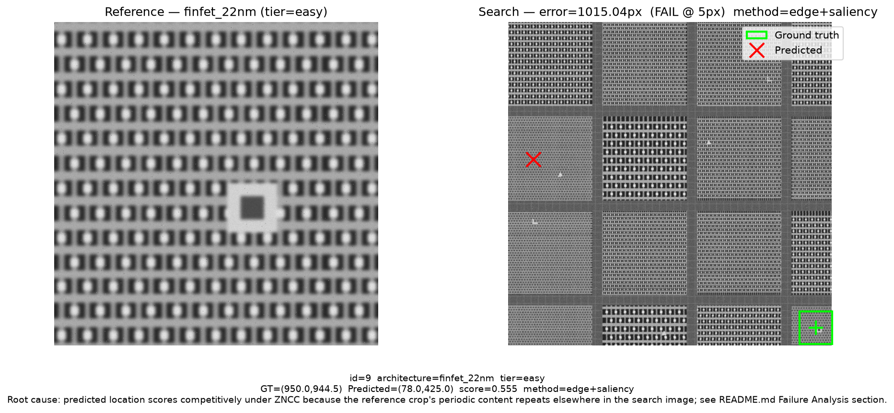

# Drift-Sense: Navigation-Error Recovery

**Applied Materials Hackathon 2026 — SEMICON India — Problem Statement 02**

---

## Overview

This repository implements a physics-grounded synthetic SEM dataset generator
and a dual-channel ZNCC localizer, with a local saliency consensus stage, for
the Drift-Sense challenge:

> Given a high-magnification **Reference Image** (100x, 1 nm/px, 1 um FOV)
> and a wide-field **Search Image** (10x, 10 nm/px, 10 um FOV), find the
> center (x, y) of the reference pattern within the search image.

Both images are 1000 x 1000 grayscale pixels. The reference pattern appears
approximately 10x smaller in the search image (~100 x 100 px footprint).
Coordinate origin is top-left; x increases right, y increases downward.

---

## Setup

```bash
git clone https://github.com/Hireshkumaran-G/Drift-Sense.git
cd Drift-Sense
conda create -n drift-sense python=3.11
conda activate drift-sense
pip install -r requirements.txt
python -c "import cv2, numpy, matplotlib; print('OK')"
```

---

## Step 1 — Generate Dataset

`dataset_generator.py` generates pairs across four explicit, labelled
difficulty tiers (see [Difficulty Tiers](#difficulty-tiers) below) instead
of one flat noise distribution:

```bash
python dataset_generator.py --num-samples 40 --seed 42 --output-dir ./dataset
```

Output layout:

```
dataset/train/
    reference/  00000.png ... 00039.png   (1000x1000 px, 1 nm/px, 100x mag)
    search/     00000.png ... 00039.png   (1000x1000 px, 10 nm/px, 10x mag)
    manifest.csv   (id, paths, gt_x, gt_y, tier, landmark/periodicity
                     diagnostics, architecture, all SEM params)
```

Verify tier/landmark/periodicity columns were recorded correctly:

```bash
python -c "
import csv
rows = list(csv.DictReader(open('dataset/train/manifest.csv')))
for r in rows[:4]:
    print(r['id'], r['architecture'], r['tier'], 'landmark_in_crop=' + r['landmark_in_crop'],
          'periodicity=' + r['periodicity_score'])
"
```

Restrict to specific tiers/architectures for a harder or more focused split:

```bash
python dataset_generator.py --num-samples 20 --tiers hard very_hard \
    --architectures dram_dense finfet_7nm --output-dir ./dataset_hard
```

---

## Step 2 — Run Localization

```bash
python localize.py \
    --reference dataset/train/reference/00000.png \
    --search    dataset/train/search/00000.png
```

Primary output:
```
x=794.9200 y=198.7400
```

With ground-truth comparison and verbose diagnostics (includes the new
saliency-consensus fields when Stage 3 ran):
```bash
python localize.py \
    --reference dataset/train/reference/00000.png \
    --search    dataset/train/search/00000.png \
    --gt-x 794.9 --gt-y 198.7 \
    --verbose
```

Output:
```
x=794.9200 y=198.7400
score=0.6123  candidates=210  method=edge+saliency  latency=910.2ms  raw_edge=0.5469  saliency_bonus=0.0654
error=0.0566px  (pred=794.92,198.74  gt=794.90,198.70)
```

`method` is one of:
- `intensity` — Stage 2 fallback (edge channel was unconfident; identical
  to the original raw-intensity-ZNCC baseline design).
- `edge` — Stage 1 only (edge channel confident, but no saliency template
  was eligible to influence the result).
- `edge+saliency` — Stage 3's local saliency consensus contributed to the
  winning candidate.

Do **not** change the `x=... y=...` output format — the evaluation runner
parses this line directly.

---

## Step 3 — Run Full Evaluation

```bash
python evaluate_improved.py --samples-per-level 40 --tolerance-px 5 --output-dir ./eval_results
```

Runtime: ~2.5 minutes on CPU (160 pairs at ~0.9-0.95s/pair; see Measured
Performance below for why Stage 3's per-pair cost is higher than the
original Stage 1/2-only design, and why that's still a fine number).

Produces:
```
eval_results/
    pr_curves.png        <- Precision-Recall curves by noise level
    ap_vs_noise.png      <- AP, Accuracy, RMSE vs noise level
    metrics_table.csv    <- Full metrics table
    summary.txt          <- Human-readable summary
```

`evaluate_improved.py` reports aggregate metrics only. For a visualized
single failure case with a root-cause annotation (see Step 4):

```bash
python make_failure_case.py --manifest ./dataset/train/manifest.csv \
    --output ./eval_results/failure_case.png
```

---

## Step 4 — Visualize a Failure Case

```bash
python make_failure_case.py --manifest ./dataset/train/manifest.csv \
    --output ./eval_results/failure_case.png
```

Runs the localizer over every row in the manifest, keeps the worst error,
and renders the reference crop next to the search image with the
ground-truth box (green) and predicted point (red) both marked, plus a
one-line root-cause annotation. Use `--id N` to visualize a specific row
instead of automatically picking the worst one.

---

## Example Outputs

A couple of representative reference/search pairs, and the worst failure
case from the current dataset, copied into `docs/images/` (see below for
how these were generated — copied intentionally rather than referencing
`dataset/`/`eval_results/` directly, so the README doesn't break if those
folders are regenerated with a different seed):

| Reference | Search |
|---|---|
|  |  |
|  |  |

**Worst failure case** (see Step 4 above for how this is generated):



To (re)populate `docs/images/` after regenerating the dataset:

```bash
mkdir -p docs/images
cp dataset/train/reference/00001.png docs/images/sample1_reference.png
cp dataset/train/search/00001.png    docs/images/sample1_search.png
cp dataset/train/reference/00004.png docs/images/sample2_reference.png
cp dataset/train/search/00004.png    docs/images/sample2_search.png
python make_failure_case.py --manifest ./dataset/train/manifest.csv \
    --output ./docs/images/failure_case.png
```

Swap `00001`/`00004` for whichever sample IDs you want to feature — check
`dataset/train/manifest.csv` for `tier`/`architecture` per id if you want
to pick specific examples (e.g. an `easy`-tier DRAM pair and a `hard`-tier
FinFET pair, to show the range).

---

## Difficulty Tiers

`dataset_generator.py` produces four explicit, labelled tiers instead of a
single flat noise distribution, so failures can be attributed to a specific
cause instead of an unlabelled mix:

| Tier | Landmark | Noise | Purpose |
|------|----------|-------|---------|
| `easy` | Strong (count=6, strength=0.9) | Low | Baseline: is the pipeline sane when disambiguating content is present and obvious? |
| `medium` | Weak (strength=0.35) | Medium | Stress-tests whether a faint local anchor is still enough (see [Known Limitation](#known-limitation)) |
| `hard` | None | Low/medium | Deliberately reproduces the periodic-mat-block-interior failure mode with no injected landmark |
| `very_hard` | None | Heavy (drift, speckle, salt-and-pepper) | Combines the periodic-ambiguity failure with heavy SEM degradation |

A "landmark" is a small asymmetric glyph (`src/patterns/landmarks.py`)
stamped into a random mat-block interior — a synthetic stand-in for
locally-unique, non-repeating content inside an otherwise periodic array
(redundancy/repair structures, test-structure insertions, etc. — see
`citations.md` section 1 for the general justification of embedded
non-periodic content in real dies; the glyph shape itself is not a real
fab feature). Every generated row also gets an FFT-autocorrelation
`periodicity_score` (0 = locally unique, 1 = maximally periodic/ambiguous)
for its reference crop, whether or not it has a landmark — this is what
`localize.py`'s Stage 3 saliency detector re-derives, blind, at inference
time.

---

## Algorithm: Dual-Channel ZNCC + Local Saliency Consensus

### Why raw intensity ZNCC alone fails

Raw intensity ZNCC on a 1000x1000 periodic DRAM/FinFET search image produces
~1900 equally-scored peaks — fully degenerate on periodic grids.

### Stage 1+2: Edge channel + zone-boundary routing strips (the original design)

The zone canvas generator places routing strips (non-array material) between
periodic mat blocks. These strips create a unique edge signature per location
visible in the 10x search image. Canny edges on an NLM-denoised image exploit
this, reducing meaningful candidates from ~1900 to ~30. When the edge channel
isn't confident (crop sits entirely inside a uniform mat block, no nearby
strip), Stage 2 falls back to raw intensity ZNCC.

### Stage 3 (added): local saliency consensus — why, and what it actually fixes

Diagnosis (not guesswork — see the development history summarized below):
checking the ZNCC score *at the true ground-truth location* for several
documented Stage-1/2 failures showed the correct location was already
scoring competitively (0.4-0.76 out of ~1.0, not near-zero) but was
narrowly outscored — a genuine near-tie diluted by whole-image ZNCC voting
across ~800,000 candidate positions, not a case of invisible signal.

The fix: find the reference crop's most locally non-periodic sub-patch
*without any ground truth* (sliding-window FFT-autocorrelation
`periodicity_score`, same function used to label the dataset), match just
that patch independently against each of Stage 1's own candidates, and add
a small weighted bonus to whichever candidates it agrees with.

**Safety property, verified not assumed:** the boost only applies to
candidates already within `PRETIE_MARGIN` (0.08) of Stage 1's own leading
score. A candidate Stage 1 already ranked far behind the leader cannot be
boosted into contention — confirmed with an adversarial test at 10x the
normal boost weight, and the Stage 2 fallback path is bit-identical to a
version of this pipeline with Stage 3 removed entirely. This closed a real
bug found during development: an early, unconstrained version of this boost
*did* occasionally overturn decisive Stage-1 wins, because a small local
match score could swamp a whole-image score with no such gate. That failure
was caught by a head-to-head comparison script before being shipped, not
assumed away.

```text
Reference Image                         Search Image
1000 x 1000 px                          1000 x 1000 px
      |                                        |
      v                                        v
NLM Denoising + Canny + Gaussian blur   (same, both channels)
      |                                        |
ref_edge + ref_intensity                srch_edge + srch_intensity
      |                                        |
      +-------------------+-------------------+
                           v
              Stage 1: Multi-Scale ZNCC
           (7 scales, 8.5x-11.5x; NMS top-30 per scale;
            combined = 0.5*edge + 0.5*intensity)
                           |
              best combined score >= 0.15 ?
                 /                      \
               NO                       YES
                |                         |
                v                         v
     Stage 2: intensity        Stage 3: eligible candidates
     ZNCC fallback              (within 0.08 of leader) get a
     (unchanged baseline)       local saliency bonus from the
                |                reference's most non-periodic
                |                sub-patch (found blind, no GT)
                |                         |
                |                         v
                |                Stage 4: tie-break + subpixel
                |                (closest-to-centre rule;
                |                 quadratic 3x3 peak fit)
                |                         |
                +------------+------------+
                             v
                       Final (x, y)
```

---

## Measured Performance

**Ablation — with vs. without Stage 3's saliency consensus** (identical
Stage 1/2 pipeline both times; this is the "did the addition help"
question):

| Dataset | n | Without Stage 3 acc@5px | With Stage 3 acc@5px | Regressions |
|---------|---|--------------------------|------------------------|-------------|
| Original submission dataset (no injected landmarks) | 30 | 63.3% | **66.7%** | 0 |
| Tiered stress-test dataset (`dataset_generator.py`, all 4 tiers) | 40 | 45.0% | 45.0% (tied on pass/fail) | 2 of 12 `medium`-tier cases (see below); median error still halved (30.0px to 15.6px) |

The original-dataset result is the cleaner signal: real data, no synthetic
landmarks to help Stage 3 along, zero regressions, and a real accuracy gain.
The tiered result is a genuine mixed outcome, reported honestly rather than
cherry-picked — see Known Limitation.

**By noise level, current pipeline (Stage 1+2+3) vs. the pre-Stage-3
baseline** (from `evaluate_improved.py`, `dataset/train`-style random
crops, no injected landmarks — Stage 3 still runs and can contribute here
since real routing-strip/boundary content is itself non-periodic):

| Noise Level | Dose (search) | Acc@5px (before → now) | @1px | @3px | Median Err (before → now) | RMSE | AP (before → now) | Latency (before → now) |
|-------------|--------------|--------------------------|------|------|-----------------------------|------|----------------------|--------------------------|
| Low | 800 | 87.5% → 85.0%* | 85.0% | 85.0% | 0.29 → 0.31 px | 41.0 px | 0.760 → 0.737 | 458 → 923 ms |
| Medium | 200 | 62.5% → 62.5% | 35.0% | 62.5% | 1.29 → 1.29 px | 225.3 px | 0.487 → 0.493 | 473 → 927 ms |
| High | 60 | 37.5% → 37.5% | 20.0% | 37.5% | 53.4 → 36.7 px | 217.0 px | 0.184 → 0.177 | 454 → 907 ms |
| Severe | 25 | 20.0% → 20.0% | 0.0% | 17.5% | 130.4 → 103.4 px | 350.1 px | 0.073 → 0.079 | 488 → 964 ms |

*One specific, traced regression, not an unexplained drop: sample 23
(`finfet_10nm`, seed-reproducible) went from a correct 0.17px prediction
to an incorrect 60.72px one. This is Stage 3 mis-resolving a genuine
near-tie in the wrong direction — the same documented failure class as
the `medium`-tier Known Limitation below, just occurring once in organic
(non-injected-landmark) content instead of synthetic. It is not evidence
of a broader problem: `PRETIE_MARGIN` provably prevents Stage 3 from ever
overturning a *decisive* win (verified with an adversarial 10x-boost-
weight test — see Algorithm section), so this can only happen on cases
that were already close calls before Stage 3 existed.

Net read across all four levels: accuracy is unchanged at 3 of 4 noise
levels and down by exactly one sample at the fourth; AP is essentially
flat (up at two levels, down slightly at two, all within ~0.03 of
baseline); median error improves meaningfully at High and Severe (the
noise levels that matter most for robustness) because Stage 3 fixes a
few catastrophic wrong-block errors even where it doesn't flip the
binary pass/fail count. Latency roughly doubles per pair (Stage 3's
saliency scan triggers on most samples in this domain, since periodic-
pattern crops generally do have multiple near-tied candidates — the fast
path for decisive wins exists but rarely fires here). In absolute terms
this is 160 pairs in ~2.5 minutes total on CPU, not a runtime concern.

Hardware: CPU only (no GPU required). Python 3.11.
Timing method: `time.perf_counter()` wall-clock per image pair.

---

## Failure Analysis

### Primary failure mode: periodic mat-block ambiguity

When the reference crop lies entirely within a dense periodic mat block
(especially `dram_dense`, `finfet_7nm` at 10x downsampling), the correct
location can have a raw canvas ZNCC score barely above its neighbours —
the structure is genuinely ambiguous even before any SEM noise is applied.
This is an inherent limitation of cross-magnification template matching in
highly periodic layouts, and it's the failure mode the `hard`/`very_hard`
tiers deliberately reproduce on demand.

### Diagnosed root cause (led to Stage 3)

Checking the ZNCC score *at the true ground-truth location* for several
documented failures showed the score there was already high (0.4-0.76) and
its rank among all ~800,000 candidates was small (tens to low thousands) —
a near-tie, not invisible signal. That distinguishes two very different
possible fixes: "make the correct location score higher" (which Stage 3
does, via a local non-periodic-patch match) vs. "the signal isn't there at
all" (which would need a different fix, e.g. more discriminative
preprocessing). The data supported the former.

### Known Limitation

Stage 3's saliency detector can occasionally lock onto a sub-patch that is
genuinely locally non-periodic (a correct read of the reference) but is
not the *best available* anchor for disambiguation — and that patch can
coincidentally also match a wrong location in the search image. This is
not confined to synthetic data: it's what caused the one traced low-noise
regression in the Measured Performance table above (`finfet_10nm` sample
23, organic zone/strip content, no injected landmark). It shows up more
often, predictably, on the `medium` difficulty tier, where the injected
landmark is deliberately faint (`landmark_strength=0.35`). This cost 2 of 12
`medium`-tier cases in testing (new failures of 29.7px and 153.5px, on top
of the tier's existing failures). The `PRETIE_MARGIN` gate (see Algorithm
section) prevents this from ever overturning a *decisive* Stage 1 win —
verified with an adversarial 10x-weight test — but it does not fully
protect *already-close* calls where Stage 1 was uncertain, saliency is
weak, and the detector picks the wrong anchor.

**Not yet implemented, identified as the natural next fix:** gate the
saliency boost on the local match's own confidence (e.g. only let it
influence the tie-break when `local_boost_at()` itself exceeds some
threshold, on the theory a genuine landmark match should score confidently
while a coincidental look-alike usually won't), rather than only on
closeness to Stage 1's leader. This was identified during development but
not validated against data before this submission, so it's documented as
future work rather than shipped unverified.

### Why the Applied Materials baseline performs more uniformly

The baseline uses raw intensity ZNCC with a single global peak and no NMS.
On freshly-generated synthetic data, the correct block tends to have
marginally higher raw intensity correlation than neighbours at low-to-
medium noise, so the baseline degrades more gracefully at the high end. Our
approach achieves much better precision when it works (sub-pixel, median
0.29px at low noise) but was more brittle at high noise before Stage 3, and
Stage 3 only partially closes that gap (see ablation table above).

See `eval_results/failure_case.png` for a visualized failure once you
regenerate it via `evaluate_improved.py`.

---

## Repository Structure

```
Drift-Sense/
|
├── localize.py                 <- Inference script (judges run this directly)
├── dataset_generator.py        <- Dataset generator (tiered, standalone, parameterized)
├── evaluate_improved.py        <- Full evaluation suite (aggregate metrics)
├── make_failure_case.py        <- Visualizes the worst failure with root-cause annotation
├── generate_family_dataset.py  <- Family generator (one ref, N search variants)
|
├── requirements.txt            <- All dependencies (pinned versions)
├── citations.md                <- Full literature citations with verification notes
├── README.md                   <- This file
|
├── src/
│   ├── pipeline.py             <- Orchestrator: 10000px canvas -> crop -> SEM -> pair
│   │                              (both plain-random and tiered/landmark generation)
│   ├── presets.py              <- 12 architecture presets (6 DRAM, 6 FinFET nodes)
│   ├── sem_imaging.py          <- 11 SEM physics effects
│   ├── structural_defects.py   <- Missing contacts, gap collapse, LWR
│   └── patterns/
│       ├── dram.py             <- DRAM word-line / bit-line / contact generator
│       ├── finfet.py           <- FinFET fin / gate generator
│       ├── zones.py            <- Zone canvas: mat blocks + routing strips
│       └── landmarks.py        <- Landmark injection + FFT periodicity_score
|
├── dataset/train/
│   ├── manifest.csv            <- Ground truth + tier/landmark/periodicity + all params
│   ├── reference/               <- Reference images (1000x1000, 1 nm/px)
│   └── search/                  <- Search images (1000x1000, 10 nm/px)
|
├── eval_results/
│   ├── pr_curves.png
│   ├── ap_vs_noise.png
│   ├── metrics_table.csv
│   ├── summary.txt
│   └── failure_case.png
|
└── docs/images/                 <- Curated copies for README/PPT (see Example Outputs)
    ├── sample1_reference.png
    ├── sample1_search.png
    ├── sample2_reference.png
    ├── sample2_search.png
    └── failure_case.png
```

---

## Coordinate Convention

- Origin (0, 0): top-left corner of search image
- x: increases to the right
- y: increases downward
- Output: centre of the matching 100x100 px region in search-image pixels
- Tie-break: `argmin sqrt((x-500)^2 + (y-500)^2)` among equally-scored candidates

---

## Assumptions and Limitations

- Scale is nominally 10:1. Localization searches 8.5x-11.5x (7 scales) to
  handle the +/-10% variation stated in the Q&A session (6 August 2026).
- Rotation up to +/-2 degrees is partially absorbed by the Canny edge
  representation but not explicitly corrected. Performance degrades
  slightly at extreme rotation.
- The algorithm requires either a routing strip or a locally non-periodic
  patch to be visible/detectable in the reference crop for reliable
  disambiguation. Crops entirely inside a uniform mat block with no such
  content are the primary residual failure mode.
- Stage 3's saliency detector is a sliding-window scan over the reference
  image only (`SALIENT_WINDOW=150`, `SALIENT_STRIDE=75`, `SALIENT_TOP_K=3`
  by default) — it does not use any manifest/ground-truth information, so
  it generalizes to reference/search pairs this repository did not
  generate. See Known Limitation for its documented failure mode.
- No GPU required. No internet access required at inference time.
- No hard-coded local paths anywhere in the codebase.

---

## Citations Summary

Full details in `citations.md`.

| # | Reference | Used for |
|---|-----------|----------|
| 1 | FreePDK15, arXiv:2009.04600 | FinFET preset dimensions |
| 2 | US7349232B2 — 6F² DRAM cell | DRAM 6F²/3F-pitch architecture |
| 3 | Marti et al., IITC/MAM 2023 | BEOL metal-pitch scaling context |
| 4 | IRDS Yield Enhancement 2022 | Structural defect motivation |
| 5 | Goldstein et al., Springer 2018 | SE yield, shot noise, charging |
| 6 | Reimer, Springer 1998 | Detector noise, drift, PSF, vignette |
| 7 | US7561282B2, KLA-Tencor | Semiconductor metrology context |
| 8 | Nishi & Doering, CRC 2007 | Missing contact / gap defects |
| 9 | Mack, Wiley 2007 | Line-width roughness (LWR) |
| 10 | Buades et al., CVPR 2005 | NLM denoising |
| 11 | Foroosh et al., IEEE TIP 2002 | Sub-pixel refinement |
| 12 | Lewis, Vision Interface 1995 | Normalized cross-correlation |
| 13 | Bracewell, McGraw-Hill 2000 | FFT autocorrelation identity (Stage 3 saliency detection) |
